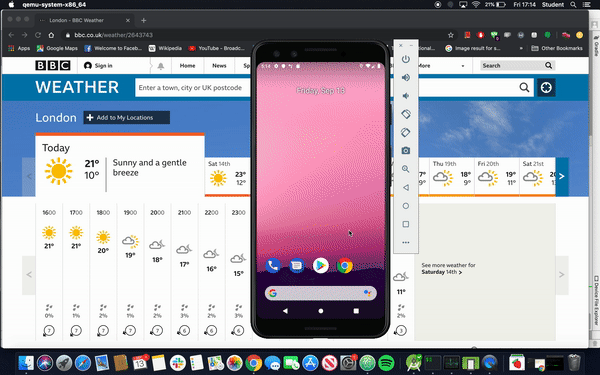
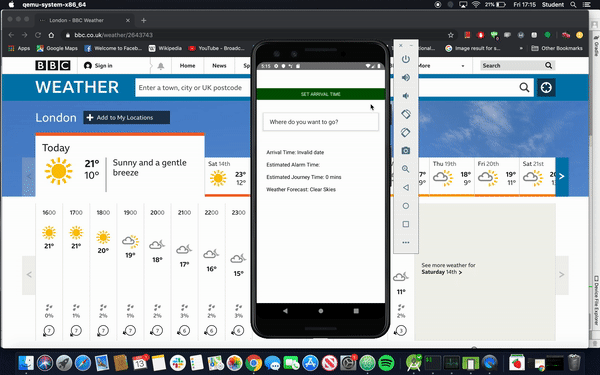
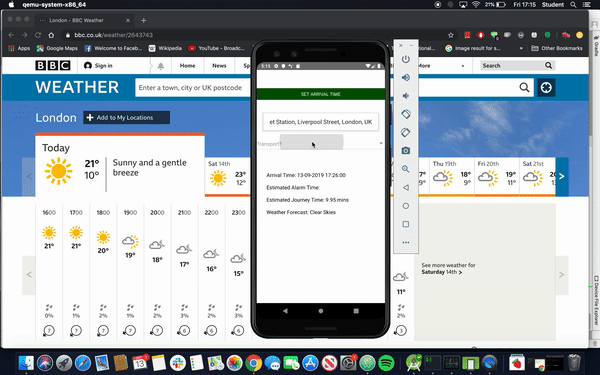
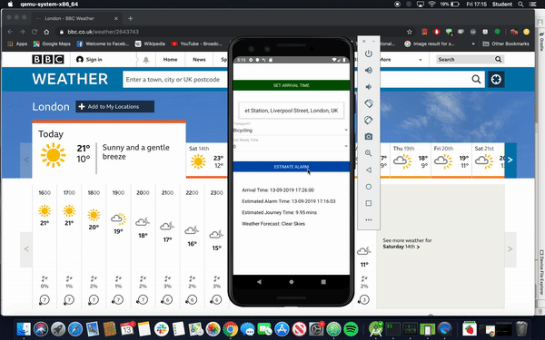

# Strawberry Alarm Clock

An alarm clock but with a twist.

Using CityMapper, Google and TomTom, the app uses traffic data and wakes a user up in line with their commute. Getting them more sleep, and sometimes a little less.

# How to deploy

```
git clone git@github.com:ckettell/strawberry-alarm-clock.git
```
```
npm install
```
From Android Studio, start your emulator.

```
react-native run-android
```

Never be late again

# In action

On open, a user will be prompted with the time they want to be somewhere, location, mode of transport, time to get ready and then calculate their alarm.

#### Opening the app (preview of the emblem)



#### Setting where you need to be and what time



#### Choice and transport and estimated get ready time



#### Calculate your alarm


The alarm sound all depends on the day's weather. Mr Blue Sky, of course, was the choice of sound on that sunny day.
